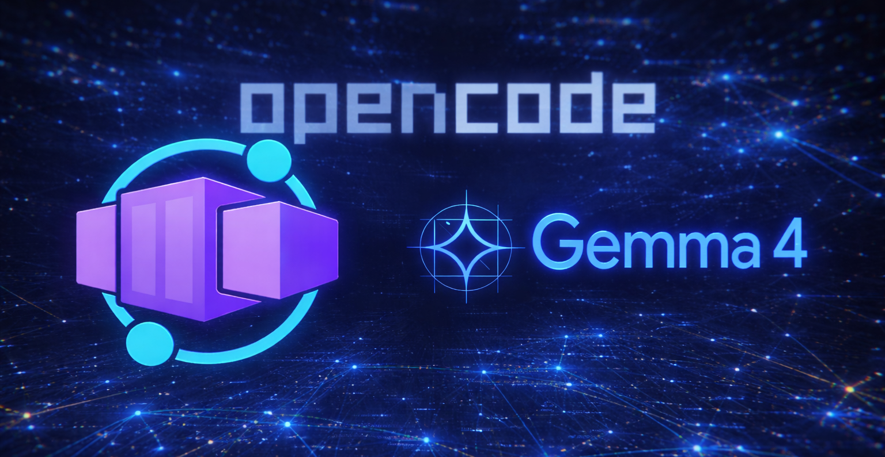
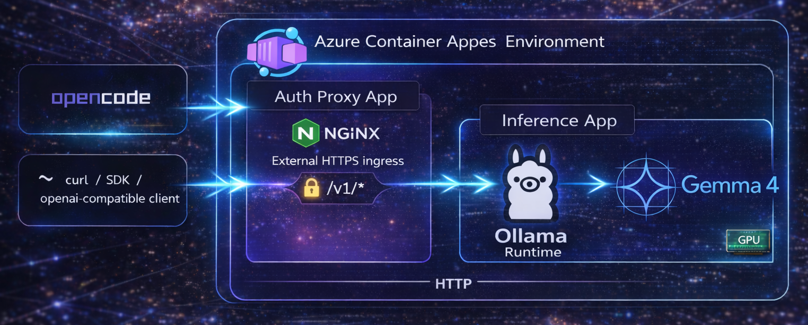
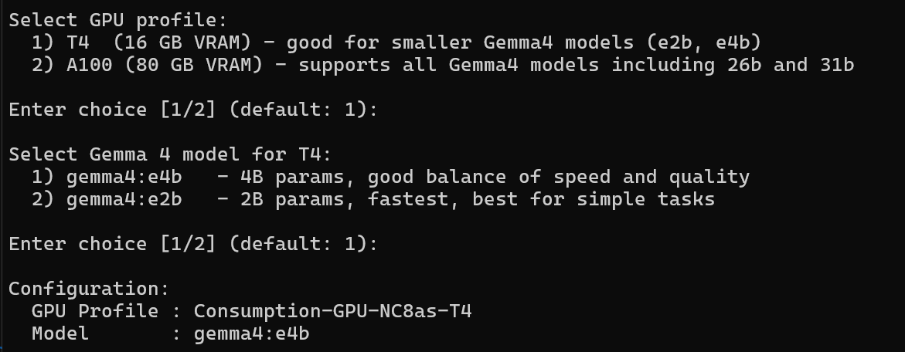
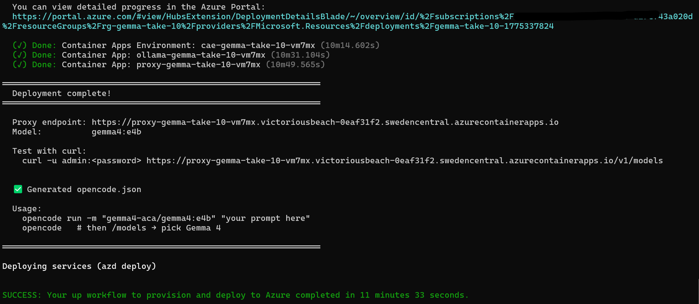

<p align="center">
  
</p>

# Gemma 4 on Azure Container Apps

Deploy Google's [Gemma 4](https://ai.google.dev/gemma/docs/core) on Azure Container Apps with serverless GPU — in minutes.

## What You Get

- **vLLM + Gemma 4** running on ACA serverless GPU (T4 or A100) — continuous batching handles concurrent requests natively
- **Nginx auth proxy** protecting the API endpoint
- **OpenAI-compatible API** ready for [OpenCode](https://opencode.ai), `curl`, or any app
- **One command deploy** via `azd up`

<p align="center">
  
</p>


## Prerequisites

- [Azure CLI](https://docs.microsoft.com/en-us/cli/azure/install-azure-cli) installed and authenticated
- [Azure Developer CLI (azd)](https://learn.microsoft.com/en-us/azure/developer/azure-developer-cli/) installed
- An Azure subscription with the `Microsoft.App` provider enabled

## Quick Start

```bash
git clone https://github.com/simonjj/gemma4-on-aca.git
cd gemma4-on-aca
azd up
```

During setup you'll be prompted to:

1. **Choose a GPU** — T4 (16 GB) or A100 (80 GB)
2. **Pick a Gemma 4 model** — options depend on your GPU choice
3. **Provide a Hugging Face access token** — Gemma weights are gated, so vLLM needs a token to download them
4. **Set a proxy password** — protects your vLLM API endpoint

<p align="center">
  
</p>

> **GPU region availability:** Serverless GPUs are available in select regions. When prompted for a location, choose from:  
> - `australiaeast`
> - `brazilsouth`
>  - `canadacentral`
>  - `eastus`
>  - `italynorth`
>  - `swedencentral` 
>  - `uksouth`
>  - `westus` 
>  - `westus3`
> [Full list →](https://learn.microsoft.com/en-us/azure/container-apps/workload-profiles-overview#gpu-workload-profiles)

## GPU + Model Options

| GPU | VRAM | Recommended Models | Best For |
|-----|------|--------------------|----------|
| **T4** | 16 GB | `gemma4:e4b` (default), `gemma4:e2b`, `gemma4:12b`† | Cost-effective, lighter workloads |
| **A100** | 80 GB | `gemma4:26b` (default), `gemma4:31b`, `gemma4:12b`, `gemma4:e4b`, `gemma4:e2b` | Maximum quality, heavy workloads |

† `gemma4:12b` requires a recent vLLM release with Gemma 4 support. This template's pre-built image tracks `vllm/vllm-openai:latest`; pin to a specific tag in [`app/vllm/Dockerfile`](app/vllm/Dockerfile) for reproducible builds.

### Model Details

| Model | Params | Architecture | Context | Modalities | Disk Size |
|-------|--------|-------------|---------|------------|-----------|
| `gemma4:e2b` | ~2B | Dense | 128K | Text, Image, Audio | ~7 GB |
| `gemma4:e4b` | ~4B | Dense | 128K | Text, Image, Audio | ~10 GB |
| `gemma4:12b` | 12B | Dense | 128K | Text, Image, Audio | ~8 GB |
| `gemma4:26b` | 26B | MoE (4B active) | 256K | Text, Image | ~18 GB |
| `gemma4:31b` | 31B | Dense | 256K | Text, Image | ~20 GB |

### Performance

Unlike Ollama, vLLM uses continuous batching and PagedAttention, so a single instance can serve **many concurrent requests** with high aggregate throughput instead of queuing them one at a time. Actual tokens/sec and time-to-first-token depend on model size, quantization, `--max-model-len`, `--gpu-memory-utilization`, and concurrency — benchmark with your own workload using [vLLM's benchmarking tools](https://docs.vllm.ai/en/latest/contributing/benchmarks.html).

> 26b and 31b require A100 — they don't fit in T4's 16 GB VRAM. `gemma4:12b` fits on T4 (16 GB) but leaves less headroom for concurrent requests, so prefer A100 for high-concurrency production workloads.

## Verify Your Deployment

<p align="center">
  
</p>

After `azd up` completes, get your endpoint and test it:

```bash
# Get deployment outputs
azd env get-values

# Test with curl (replace with your values)
curl -u admin:<YOUR_PASSWORD> \
  https://<YOUR_PROXY_ENDPOINT>/v1/chat/completions \
  -H "Content-Type: application/json" \
  -d '{
    "model": "gemma4:e4b",
    "messages": [{"role": "user", "content": "Hello, what can you do?"}]
  }'
```

## Connect OpenCode

[OpenCode](https://opencode.ai) is a terminal-based AI coding agent that supports 75+ LLM providers. Point it at your deployed Gemma 4 endpoint to use it as a coding assistant — all inference runs on your own GPU.

### Configure

Create or edit `opencode.json` in your project root:

```json
{
  "$schema": "https://opencode.ai/config.json",
  "provider": {
    "gemma4-aca": {
      "npm": "@ai-sdk/openai-compatible",
      "name": "Gemma 4 on ACA",
      "options": {
        "baseURL": "https://<YOUR_PROXY_ENDPOINT>/v1",
        "headers": {
          "Authorization": "Basic <BASE64_OF_admin:YOUR_PASSWORD>"
        }
      },
      "models": {
        "gemma4:e4b": {
          "name": "Gemma 4 e4b (4B)"
        }
      }
    }
  }
}
```

> Generate the Base64 value with: `echo -n "admin:<YOUR_PASSWORD>" | base64`

### Use It

```bash
# Start OpenCode TUI
opencode

# Select your model
/models
# → Pick "Gemma 4 e4b (4B)"

# Start coding
> Write a REST API for user management in Go
```

Or run non-interactively:

```bash
opencode run -m "gemma4-aca/gemma4:e4b" "Write a binary search in Rust"
```

### Direct API (No Agent)

The endpoint is fully OpenAI-compatible, so any tool that supports OpenAI's API works:

```bash
curl -u admin:<YOUR_PASSWORD> \
  https://<YOUR_PROXY_ENDPOINT>/v1/chat/completions \
  -H "Content-Type: application/json" \
  -d '{
    "model": "gemma4:e4b",
    "messages": [
      {"role": "system", "content": "You are a helpful coding assistant."},
      {"role": "user", "content": "Write a binary search in Rust"}
    ],
    "temperature": 0.7
  }'
```

## Pre-built Container Images

This template uses pre-built images hosted on a public Azure Container Registry. No local Docker builds are needed.

| Image | URL |
|-------|-----|
| vLLM (OpenAI-compatible server) | `ssagentfactory.azurecr.io/gemma4-on-aca/vllm:latest` |
| Nginx Auth Proxy | `ssagentfactory.azurecr.io/gemma4-on-aca/nginx-auth-proxy:latest` |

Both images support anonymous pull. To use your own registry, see [`scripts/README.md`](scripts/README.md).

## Architecture

```
[Your App / OpenCode / curl]
        │
        ▼
┌─────────────────────────┐
│  Nginx Auth Proxy       │  ← external HTTPS, basic auth
│  (Consumption profile)  │
└─────────┬───────────────┘
          │ internal
          ▼
┌─────────────────────────┐
│  vLLM + Gemma 4         │  ← GPU workload profile
│  (T4 or A100)           │
│                         │
│  start-vllm.sh:         │
│    vllm serve $MODEL_ID │
│    (continuous batching │
│     for concurrent reqs)│
└─────────────────────────┘
```

**Resources created:**
- ACA Environment (with GPU workload profile)
- 2 Container Apps (using pre-built images from a public registry)

No VNet, no storage accounts, no container registry — kept intentionally simple. Model weights are downloaded from Hugging Face fresh on each cold start (~1-2 min for smaller models, ~5 min for 26b/31b).

## Configuration

### Change Model After Deployment

```bash
# Update the model environment variables
az containerapp update \
  --name <vllm-app-name> \
  --resource-group <resource-group> \
  --set-env-vars MODEL_ID="google/gemma-4-26b-it" SERVED_MODEL_NAME="gemma4:26b"

# Restart to load the new model
az containerapp revision restart \
  --name <vllm-app-name> \
  --resource-group <resource-group>
```

### Tear Down

```bash
azd down
```

## Project Structure

```
gemma4-on-aca/
├── azure.yaml              # azd configuration
├── README.md
├── LICENSE
├── app/
│   ├── vllm/               # vLLM image source
│   │   ├── Dockerfile      # vllm/vllm-openai:latest + start script
│   │   └── start-vllm.sh   # Launches `vllm serve` with concurrent-request batching
│   └── nginx-auth-proxy/   # Auth proxy image source
│       ├── Dockerfile
│       ├── entrypoint.sh
│       └── default.conf.template
├── hooks/
│   ├── select-gpu-model.sh   # Linux/macOS setup
│   └── select-gpu-model.ps1  # Windows setup
├── scripts/
│   ├── build-and-push.sh     # Rebuild images to your own registry
│   └── build-and-push.ps1
└── infra/
    ├── main.bicep
    ├── main.parameters.json
    └── resources.bicep
```

## Troubleshooting

| Issue | Solution |
|-------|----------|
| Deployment takes a long time | The model is downloaded from Hugging Face on first start. Gemma4 models range from 7-20 GB. Check the vLLM container logs in the Azure Portal. |
| `curl` returns 502/503 | The model may still be loading. Wait a few minutes and retry. Check vLLM logs via: `az containerapp logs show --name <vllm-app-name> -g <rg>` |
| 401/403 downloading model weights | Your `HUGGING_FACE_TOKEN` is missing, invalid, or hasn't accepted the Gemma license on Hugging Face. Set it with `azd env set HUGGING_FACE_TOKEN <token>` and redeploy. |
| Out of memory errors | Your chosen model is too large for the selected GPU, or `GPU_MEMORY_UTILIZATION`/`MAX_MODEL_LEN` are too high for available VRAM at your expected concurrency. Redeploy with a smaller model, lower these values, or upgrade to A100. |
| Authentication errors | Verify your proxy password. Check with: `curl -u admin:<password> https://<endpoint>/v1/models` |

## Contributing

Changes and improvements are welcome via pull requests. For issues or questions, [raise an issue](https://github.com/simonjj/gemma4-on-aca/issues).

## License

Apache 2.0 — see [LICENSE](LICENSE).
